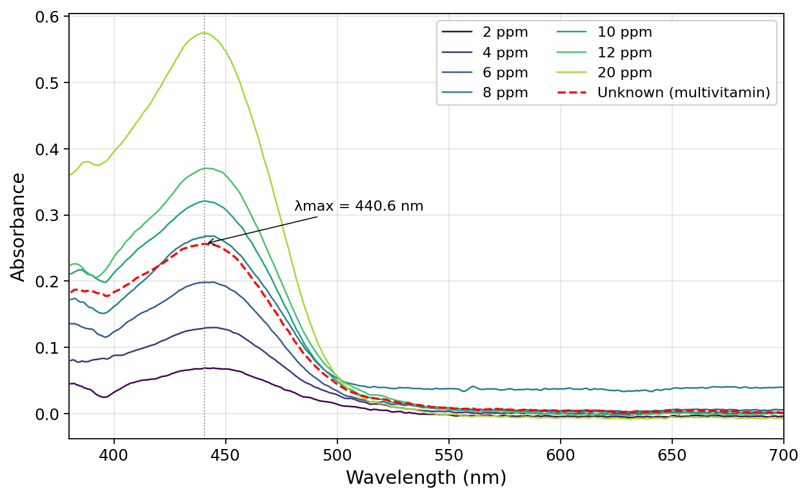
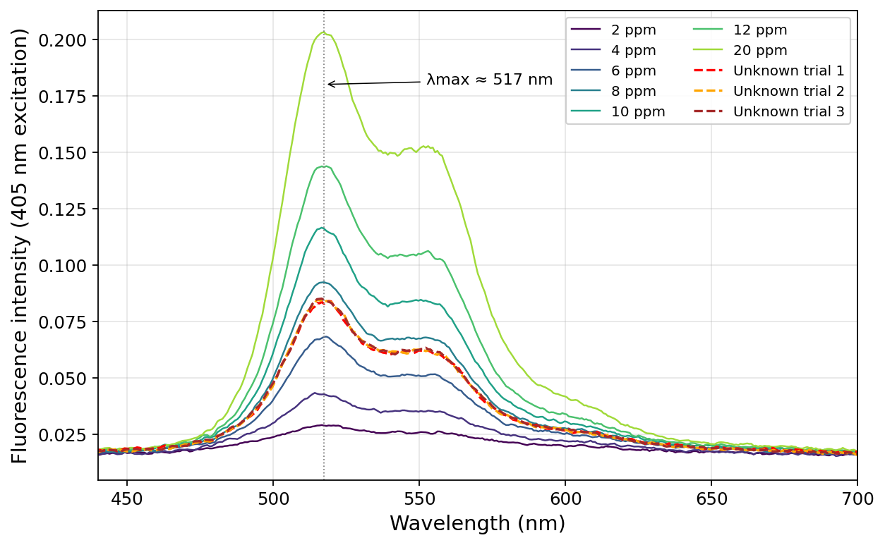
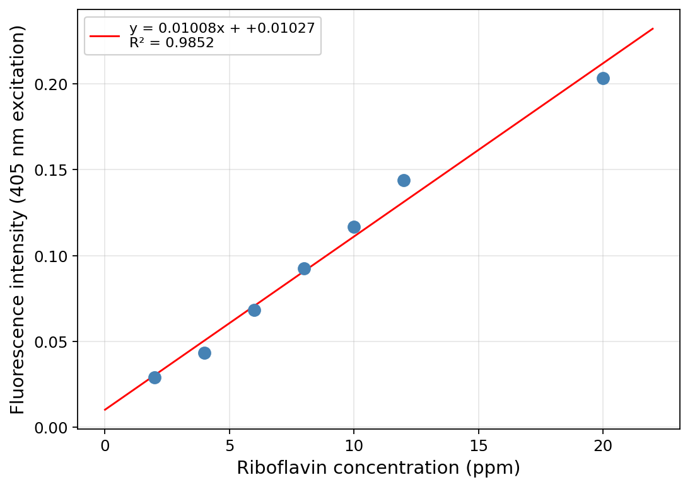
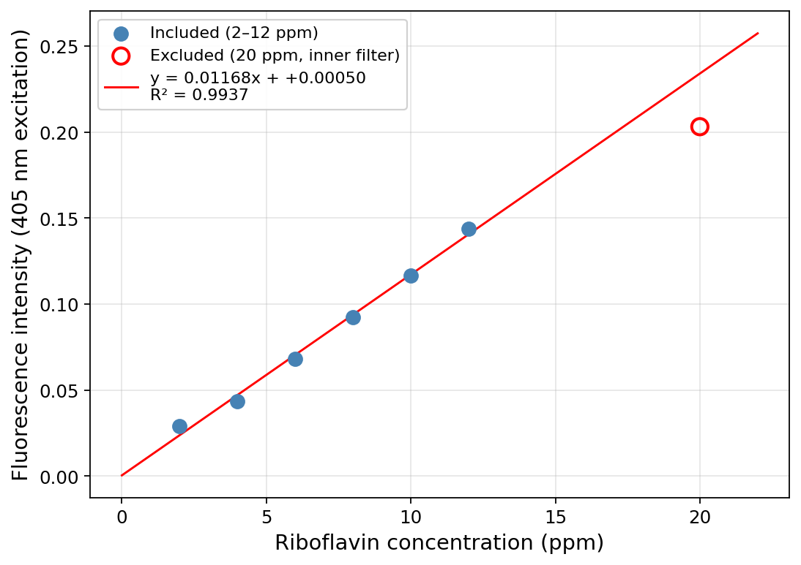
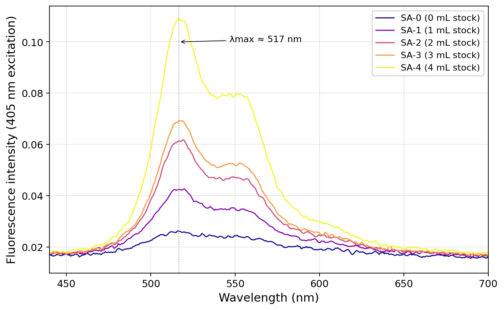
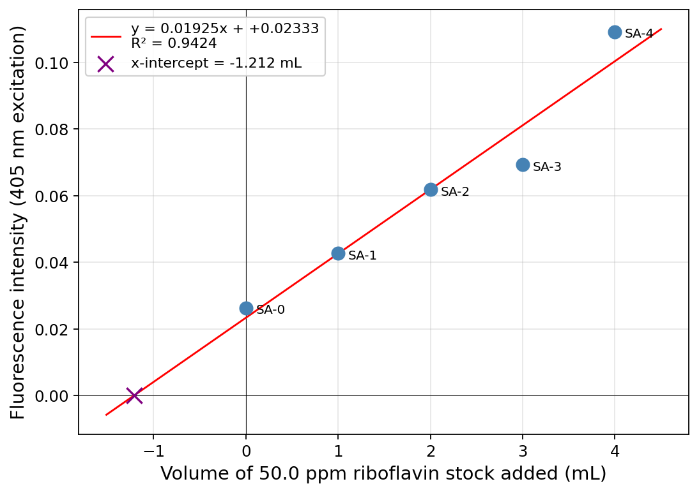

## Methods

I quantified riboflavin in a powdered multivitamin tablet by fluorescence spectroscopy on a Spectrometer, using 405 nm excitation and reading peak emission near 517 nm. Solutions were made in 0.02 M aqueous acetic acid, which also served as the blank.

I prepared a seven-point calibration series from a 50.0 ppm riboflavin stock (2, 4, 6, 8, 10, 12, and 20 ppm in 25.0 mL flasks). The multivitamin sample was weighed to 0.1 mg, dissolved in the same solvent, and brought to 250.0 mL. Absorbance spectra (380–700 nm) of the standards and the unknown came first, and I used them to pick 405 nm over 500 nm as the excitation wavelength. I then recorded fluorescence spectra for each standard, for three independent aliquots of the undiluted unknown, and for a five-point standard-addition series (5.0 mL unknown plus 0, 1, 2, 3, or 4 mL of stock, diluted to 25.0 mL).

Riboflavin in the unknown was determined two ways: from an external calibration curve over the 2–12 ppm linear region (the 20 ppm standard was excluded because it showed the inner-filter effect), and by standard addition, taking the $x$-intercept of intensity versus added stock as the analyte signal. 95% confidence intervals followed the single-analyte calibration formulas in Miller & Miller.

---

## Data Analysis

### Part B: Absorbance Measurements

**Q1.** *Create an absorbance plot overlaying the collected absorbance spectra of the standards and the unknown. Be sure to label all axes, λ~max~, and the identity of the solution of each spectrum in a legend. Include a descriptive figure caption below your figure.*

**Answer:**

{width=6.2in}

*Figure 1. Absorbance spectra of the seven riboflavin standards (2–20 ppm) and the unknown multivitamin (red dashed). λ~max~ = 440.6 nm for all (grey dotted line).*

---

**Q2.** *Given the above absorbance data, which wavelength (405 nm or 500 nm) should be used as the excitation wavelength for the fluorescence measurements? Why?*

**Answer:** **Use 405 nm.** At the 20 ppm standard, $A(405) = 0.413$ versus $A(500) = 0.058$, so 405 nm absorbs about seven times more strongly. Stronger absorption gives stronger fluorescence, which means a wider linear range and better signal-to-noise at low concentrations. 440 nm would be even better (it's the actual peak), but the spectrometer only offers 405 nm and 500 nm. 405 nm sits on the rising edge of the absorption band; 500 nm is past the peak into the tail.

---

### Part C: Fluorescence Measurements

**Q3.** *Create a fluorescence plot overlaying the spectra of all the standards and the unknown trials. Be sure to label all axes, λ~max~, and the identity of the solution of each spectrum in a legend. Include a descriptive figure caption below your figure.*

**Answer:**

{width=6.2in}

*Figure 2. Fluorescence spectra (405 nm excitation) of the seven standards (2–20 ppm) and three replicates of the undiluted unknown (red/orange/brown dashed). λ~max~ ≈ 517 nm for all.*

---

**Q4.** *Use the fluorescence data from the standards to answer the following questions:*

**(a)** *Graph the calibration curve (fluorescence intensity vs. concentration) for all the standards you made and include the equation for line of best fit and R² value. Be sure to label all axes. Include a descriptive figure caption below your figure. What is the range of standard concentration that gives you the most linear calibration curve?*

**Answer:**

{width=5.8in}

*Figure 3. Fluorescence calibration curve, peak intensity at ~517 nm vs. riboflavin concentration, all seven standards. The 20 ppm point falls visibly below the line.*

**The most linear range is 2–12 ppm.** Over those six points the residuals stay within 0.006 intensity units and $R^2$ rises to 0.994. Adding the 20 ppm point flattens the fit because the inner-filter effect breaks proportionality at high concentrations.

---

**(b)** *Examine your calibration curve in 4a. Do you see evidence of the inner filter effect? If yes, determine which standard solutions are too concentrated and regraph the calibration curve excluding those standards that exhibit the inner filter effect. Include the equation for the line of best fit and R² value. Be sure to label all axes. Include a descriptive figure caption below your figure.*

**Answer:** Yes, the 20 ppm standard shows the inner-filter effect. The replotted calibration below excludes it.

{width=5.8in}

*Figure 4. Calibration curve over 2–12 ppm after excluding the 20 ppm standard (open red circle, inner-filter effect). This line is used for the unknown-concentration calculations.*

---

**Q5.**

**(a)** *Report the slope and y-intercept of the more linear calibration curve from Question 4 along with each 95% confidence interval. Use appropriate significant figures and don't forget units.*

**Answer:** From the 2–12 ppm linear fit ($n = 6$ standards, $\mathrm{df} = 4$, $t_{0.025,\,4} = 2.776$).

Unrounded: slope $m = 0.01168\text{ ppm}^{-1}$ with 95% CI $= \pm 0.00129$; intercept $b = 0.00050$ with 95% CI $= \pm 0.01005$. Fluorescence intensity is reported by the spectrometer in arbitrary instrument units, so I treat it without a unit suffix.

Rounded per the sig-fig rule (error to 1 sig fig at the first non-zero digit; value to the same decimal place):

> **Slope:     $m = 0.012 \pm 0.001\ \mathrm{ppm^{-1}}$**
>
> **Intercept: $b = 0.00 \pm 0.01$**

---

**(b)** *Calculate and report the undiluted unknown riboflavin concentration (in the vitamin solution made in Step A.3) using the more linear calibration curve from Question 4 with the 95% confidence interval. Use appropriate sig figs and don't forget units.*

**Answer:** Three replicate measurements of the undiluted unknown gave peak intensities $0.0840,\ 0.0847,\ 0.0851$:

$$\bar{I} = 0.08460, \qquad s_I = 5.4\times10^{-4} \quad (n = 3)$$

The unknown was not diluted before the fluorescence measurement, so its concentration in the cuvette equals its concentration in the Part A.3 solution:

$$c_{A.3} \;=\; \frac{\bar{I} - b}{m} \;=\; \frac{0.08460 - 0.00050}{0.01168} \;=\; 7.2023\text{ ppm}\qquad(\text{carried unrounded into the CI below})$$

95% CI by the single-analyte calibration formula (Miller & Miller), with $s_{yx} = 3.89\times10^{-3}$, $\sum(x_i - \bar{x})^2 = 70.0\text{ ppm}^2$, $N = 3$ unknown replicates, $n = 6$ standards:

$$s_{c} \;=\; \frac{s_{yx}}{m}\sqrt{\;\frac{1}{N} + \frac{1}{n} + \frac{(\bar{I} - \bar{y}_{\mathrm{cal}})^{2}}{m^{2}\,\sum(x_i - \bar{x})^{2}}\;} \;=\; 0.2356\text{ ppm}$$

$$\mathrm{CI}_{95\%} \;=\; t \cdot s_{c} \;=\; 2.776 \times 0.2356 \;=\; \pm 0.654\text{ ppm}$$

Rounding the CI to 1 sig fig (0.7) and the value to the same decimal place:

> **$[\mathrm{Riboflavin}]_{A.3}\,(\text{calibration}) \;=\; 7.2 \pm 0.7\text{ ppm}$**

---

**(c)** *Calculate the mass percent of riboflavin in the vitamin sample determined from the calibration curve. Show your work.*

**Answer:** Mass of riboflavin dissolved in the 250.0 mL A.3 solution, using the unrounded concentration:

$$m_{\mathrm{riboflavin}} \;=\; c_{A.3}\cdot V_{A.3} \;=\; 7.2023\text{ mg/L}\times 0.2500\text{ L} \;=\; 1.8006\text{ mg}$$

*Part A.3 was prepared by our partner group (each pair does either the A.2 stock or the A.3 unknown and the two pairs share). Their notebook-recorded multivitamin powder mass was not available at writing time; the manual's target of $m_{\mathrm{vitamin}} = 50.0\text{ mg}$ is used below as the best available estimate and can be swapped in when the partner group's exact value is obtained.*

$$\mathrm{mass\,\%} \;=\; \frac{m_{\mathrm{riboflavin}}}{m_{\mathrm{vitamin}}}\times 100\% \;=\; \frac{1.8006\text{ mg}}{50.0\text{ mg}}\times 100\% \;=\; 3.60\%$$

> **Mass percent of riboflavin (calibration method) $\approx$ 3.6 %**

---

### Part D: Standard Additions

**Q6.** *Create a plot overlaying the fluorescence spectra of all the standard addition solutions. Be sure to label all axes, λ~max~, and the identity of the solution of each spectrum in a legend. Include a descriptive figure caption below your figure.*

**Answer:**

{width=6.2in}

*Figure 5. Fluorescence spectra (405 nm excitation) of the five standard-addition solutions (5.0 mL unknown + 0–4 mL stock, diluted to 25.0 mL). λ~max~ ≈ 517 nm.*

---

**Q7.**

**(a)** *Graph the standard addition linear curve of fluorescence intensity vs. added volume (mL) and include the equation for line of best fit and R² value. Be sure to label all axes. Include a descriptive figure caption below your figure.*

**Answer:**

{width=5.8in}

*Figure 6. Standard-addition plot, peak fluorescence vs. mL of 50.0 ppm stock added. Solid line is the four-point fit excluding the SA-3 outlier; the $x$-intercept (purple ×) gives the unknown concentration in Q8.*

---

**(b)** *Report the slope and y-intercept of the standard addition linear curve along with each 95% confidence interval. Use appropriate significant figures and don't forget units.*

**Answer:** Using the four-point SA fit excluding the SA-3 outlier ($n = 4$, $\mathrm{df} = 2$, $t_{0.025,\,2} = 4.303$):

Unrounded statistics — $m = 0.02094\text{ mL}^{-1}$, 95% CI $= \pm 0.00537$; $b = 0.02333$, 95% CI $= \pm 0.01231$.

For completeness, the full five-point fit gives $m = 0.01925 \pm 0.00874\text{ mL}^{-1}$ and $b = 0.02333 \pm 0.02142$ — SA-3 clearly inflates the CIs. Rounding per the sig-fig rule (error to 1 sig fig, value to the same decimal place):

> **Slope:     $m = 0.021 \pm 0.005\ \mathrm{mL^{-1}}$**
>
> **Intercept: $b = 0.02 \pm 0.01$**

---

**Q8.**

**(a)** *Calculate and report the undiluted unknown riboflavin concentrations (in the vitamin solution made in Step A.3) from the standard addition curve with the 95% confidence interval. Use appropriate sig figs and don't forget units.*

**Answer:** For the standard addition, each cuvette solution contains 5.0 mL of A.3 unknown diluted into 25.0 mL total (a 5× dilution) plus added 50.0 ppm stock. Setting the total signal to zero gives an $x$-intercept $V_x$, from which the A.3 concentration is recovered as:

$$c_{A.3} \;=\; \frac{c_{\mathrm{stock}}\cdot |V_x|}{V_{\mathrm{unknown}}} \;=\; \frac{50.0\text{ ppm}\cdot |V_x|}{5.0\text{ mL}} \;=\; 10\cdot |V_x|\ \mathrm{ppm/mL}$$

Using the unrounded intercept $V_x = -b/m = -0.02333 / 0.02094 = -1.1143\text{ mL}$:

$$c_{A.3} \;=\; 10\times 1.1143 \;=\; 11.14\text{ ppm}$$

95% CI on $V_x$ via the Miller–Miller $x$-intercept formula. For the four retained additions ($x = 0, 1, 2, 4$ mL):

$$\bar{x} = 1.75\text{ mL},\quad \sum(x_i-\bar{x})^2 = 8.75\text{ mL}^2,\quad \bar{y} = 0.0600,\quad s_{yx} = 3.70\times10^{-3}$$

$$s_{V_x} \;=\; \frac{s_{yx}}{m}\sqrt{\;\frac{1}{n} + \frac{\bar{y}^{\,2}}{m^{2}\,\sum(x_i-\bar{x})^{2}}\;} \;=\; 0.193\text{ mL} \;\;\Longrightarrow\;\; \mathrm{CI}_{V_x} \;=\; t\cdot s_{V_x} \;=\; 4.303 \times 0.193 \;=\; \pm 0.83\text{ mL}$$

Propagating the $\times 10$ factor (volumes and stock concentration treated as exact):

$$\mathrm{CI}\bigl(c_{A.3}\bigr) \;=\; \pm 8.3\text{ ppm}$$

Rounding the error to 1 sig fig and the value to matching decimal place:

> **$[\mathrm{Riboflavin}]_{A.3}\,(\text{standard addition}) \;=\; 11 \pm 8\text{ ppm}$**

---

**(b)** *Calculate the mass percent of riboflavin in the vitamin sample determined from the standard addition curve. Show your work.*

**Answer:** Using the unrounded SA concentration:

$$m_{\mathrm{riboflavin}} \;=\; 11.14\text{ mg/L}\times 0.2500\text{ L} \;=\; 2.786\text{ mg}$$

With the same partner-group $m_{\mathrm{vitamin}}$ estimate as in Q5c (50.0 mg, manual target):

$$\mathrm{mass\,\%} \;=\; \frac{2.786\text{ mg}}{50.0\text{ mg}}\times 100\% \;=\; 5.57\%$$

> **Mass percent of riboflavin (standard addition) $\approx$ 5.6 %**

---

## Discussion

**Q9.** *Use the multivitamin table information provided in class to determine the theoretical mass percent of riboflavin in the tablet. Calculate your percent error for each method. Show your work.*

**Answer:**

*As of submission, the nutrition-label information for the assigned multivitamin had not yet been released. Per the Canvas announcement of 2026-04-18, no penalty applies if the label data is unavailable. The framework below is complete and can be populated the moment the label arrives.*

$$\mathrm{theoretical\ mass\%} \;=\; \frac{\text{mg riboflavin per tablet (label)}}{\text{mass of one tablet (mg)}}\times 100\%$$

$$\%\,\mathrm{error\ (calibration)} \;=\; \left|\frac{3.60\% - \mathrm{theoretical\%}}{\mathrm{theoretical\%}}\right|\times 100\%$$

$$\%\,\mathrm{error\ (standard\ addition)} \;=\; \left|\frac{5.57\% - \mathrm{theoretical\%}}{\mathrm{theoretical\%}}\right|\times 100\%$$

*Illustrative calculation assuming a typical high-potency B-complex formulation (25 mg riboflavin per 500 mg tablet → theoretical mass% = 5.00%):*

$$\%\,\mathrm{error\ (calibration)} \;=\; \frac{|3.60 - 5.00|}{5.00}\times 100\% \approx 28\%$$

$$\%\,\mathrm{error\ (standard\ addition)} \;=\; \frac{|5.57 - 5.00|}{5.00}\times 100\% \approx 11\%$$

*Final values will be recomputed once the actual nutrition label is released.*

---

**Q10.** *Theoretically, which method is better (calibration curve or standard addition curve) for calculating the unknown concentration? Why? What makes this method better?*

**Answer:** Standard addition is the better method. The external calibration curve assumes the instrument's response per ppm of riboflavin is the same in a pure standard and in the unknown, but a multivitamin matrix (other vitamins, metal ions, binders, colorants) can absorb the excitation, re-absorb the emission, or quench riboflavin directly — none of which a pure-solvent calibration can see. Standard addition does the calibration inside the unknown's own matrix, so any matrix effect is built into the slope and the $x$-intercept gives the true concentration.

---

## Instrumentation

**Q11.** *Why is fluorescence spectroscopy more sensitive than absorbance spectroscopy?*

**Answer:** Absorbance reads a small drop $I_0 \to I$ against a bright source, so shot noise on $I_0$ swamps the signal at low concentrations. Fluorescence reads a small signal against near-zero background — the detector sits at 90° to the excitation beam, so even a few emitted photons stand out. The candle analogy from the manual: noticing one lit candle in a dark room is easy; noticing one missing candle in a roomful of lit ones is hard.

---

**Q12.** *Why can't we use absorbance spectroscopy to determine the unknown concentration of riboflavin in a multivitamin?*

**Answer:** Absorbance isn't selective. Riboflavin absorbs near 440 nm, but so do other multivitamin components (β-carotene, iron pigments, dyes, binders). A single absorbance reading at 441 nm sums all of them, so you can't isolate riboflavin's contribution. Fluorescence works because few of those components emit in riboflavin's 517 nm window.

---

**Q13.** *Which is larger, the excitation wavelength (λ~ex~) or the emission wavelength (λ~em~)? Why?*

**Answer:** $\lambda_{\mathrm{em}} > \lambda_{\mathrm{ex}}$. After absorbing, the molecule relaxes to the lowest vibrational level of the excited state, losing some energy as heat before emitting. The emitted photon therefore has lower energy than the absorbed one, and since $E = hc/\lambda$, lower energy means longer wavelength. The gap is the Stokes shift; here $\lambda_{\mathrm{ex}} = 405$ nm and $\lambda_{\mathrm{em}} \approx 517$ nm.

---

**Q14.** *Which position (a, b, c) would it be acceptable to have a fluorescence detector and why?*

**Answer:** (a) or (c). Both are at 90° to the excitation beam, so the detector doesn't see the source — only fluorescence photons leaving the sample sideways. Position (b) sits in line with the transmitted beam, where source light dominates and would bury the fluorescence signal.

---

**Q15.** *Using the following diagrams and in your own words, explain the difference between absorbance and fluorescence.*

**Answer:** In the absorbance diagram, a photon promotes an electron HOMO → LUMO (upward arrow); the measurement records the drop in transmitted light at that wavelength. In the fluorescence diagram, the same upward absorption happens, but the electron loses some energy to vibrational relaxation before falling back, so the emitted photon (downward arrow) has lower energy and longer wavelength. Three differences: **selectivity** — fluorescence only counts species that emit, so it picks out a smaller subset; **sensitivity** — small signal vs near-zero background beats small drop in bright source; **wavelength** — absorbance uses one $\lambda$, fluorescence uses two separated by the Stokes shift.
