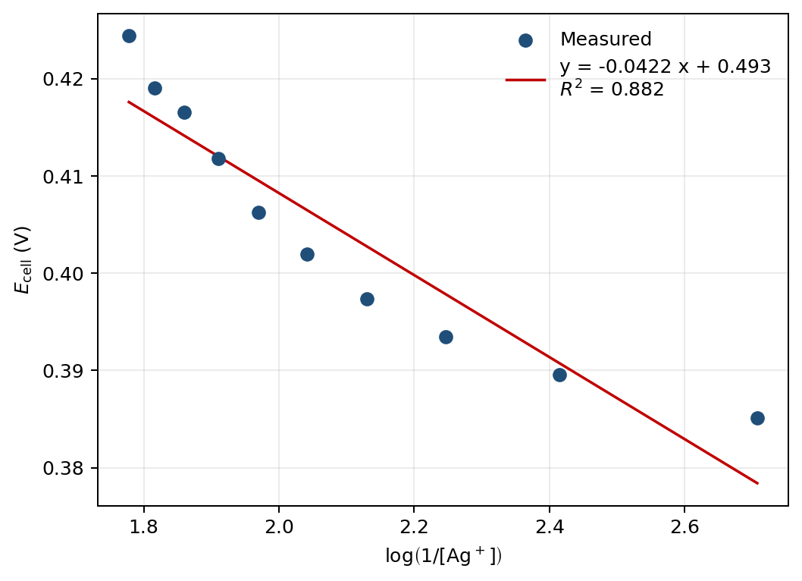
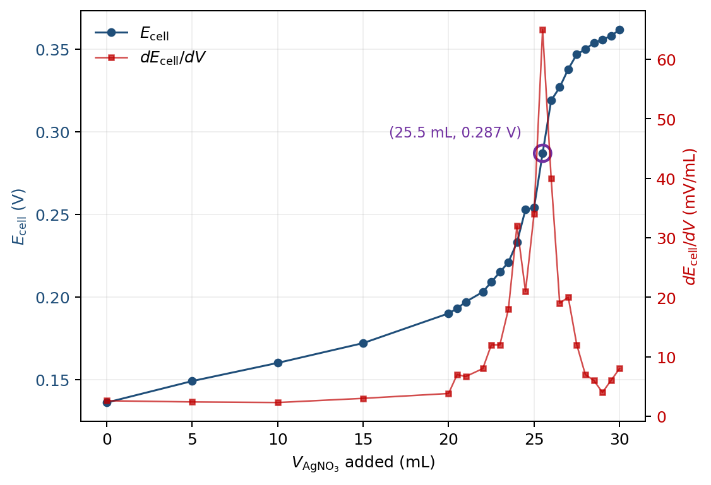
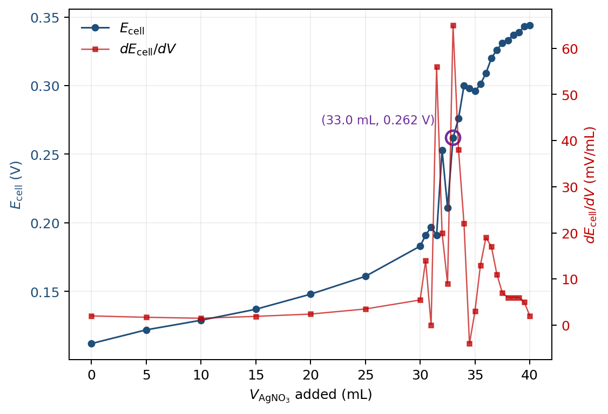

# Data Analysis

## Part A

**Q1.** *Create a plot of $E_\mathrm{cell}$ versus $\log(1/[\mathrm{Ag^+}])$. Include your line of best fit and $R^2$ on the plot. Properly format the plot and include a descriptive figure caption below your figure. Explicitly write out how the line of best fit equation relates to the Nernst equation and your experimental Nernst equation.*

**Figure 1.** $E_\mathrm{cell}$ vs. $\log(1/[\mathrm{Ag^+}])$ for the Part A Nernst calibration; linear fit (red) gives the slope and intercept reported in Q2 and Q4.

Line of best fit:

$$E_\mathrm{cell} = -0.04215\,\log\!\left(\tfrac{1}{[\mathrm{Ag^+}]}\right) + 0.4925\;\mathrm{V}.$$

The Nernst equation for Ag$^+$ + e$^-$ $\to$ Ag(s) (manual eq. 8, $n=1$) is

$$E_\mathrm{cell} = \left(E^\circ_{\mathrm{Ag^+/Ag}} - 0.307\right) - \frac{0.05916}{n}\log\!\left(\tfrac{1}{[\mathrm{Ag^+}]}\right),$$

so slope $\leftrightarrow -0.05916/n$ and intercept $\leftrightarrow E^\circ_{\mathrm{Ag^+/Ag}} - 0.307$.

---

**Q2.** *Determine the slope from the linear fit and report it with the appropriate 95% CI. Use appropriate significant figures and don't forget units.*

From the LINEST regression on the 10 points ($n = 10$, df = 8, $t_{0.025,8} = 2.306$):

$$\text{slope} = -0.04215\;\mathrm{V/dec},\qquad SE_\text{slope} = 0.00545\;\mathrm{V/dec}.$$
$$95\%\;\mathrm{CI} = t \cdot SE = 2.306 \times 0.00545 = 0.0126\;\mathrm{V/dec}.$$

$$\boxed{\text{slope} = -0.04 \pm 0.01\;\mathrm{V/dec}}$$

---

**Q3.** *What is the theoretical number of electrons required in this half reaction at the indicator electrode? Calculate the experimentally determined number of electrons in this half reaction. Show your work.*

The indicator half-reaction is Ag$^+$ + e$^-$ $\to$ Ag(s), so $n_\text{theoretical} = 1$.

From Q2, the slope magnitude is $0.05916/n$:

$$n_\text{experimental} = \frac{0.05916}{|\text{slope}|} = \frac{0.05916}{0.04215} = 1.40.$$

Propagating the slope uncertainty:

$$\sigma_n = n \cdot \frac{\sigma_\text{slope}}{|\text{slope}|} = 1.40 \times \frac{0.00545}{0.04215} = 0.182,$$
$$95\%\;\mathrm{CI}(n) = t \cdot \sigma_n = 2.306 \times 0.182 = 0.42.$$

$$\boxed{n_\text{experimental} = 1.4 \pm 0.4}$$

---

**Q4.** *Determine the y-intercept from the linear fit and report it with the appropriate 95% CI. Use appropriate significant figures and don't forget units.*

From the LINEST regression:

$$\text{intercept} = 0.49254\;\mathrm{V},\qquad SE_\text{intercept} = 0.01148\;\mathrm{V}.$$
$$95\%\;\mathrm{CI} = 2.306 \times 0.01148 = 0.0265\;\mathrm{V}.$$

$$\boxed{\text{intercept} = 0.49 \pm 0.03\;\mathrm{V}}$$

---

**Q5.** *Calculate $E^\circ_{\mathrm{Ag^+/Ag}}$ from your intercept value. Be sure to use propagation of error to calculate the appropriate 95% CI. Compare your $E^\circ_{\mathrm{Ag^+/Ag}}$ value to the literature value for the standard reduction potential of silver from the CRC Handbook value using a percent error. Show your work.*

Solving the intercept relation $b = E^\circ - 0.307$ for $E^\circ$:

$$E^\circ_{\mathrm{Ag^+/Ag}} = b + 0.307 = 0.492542 + 0.307 = 0.799542\;\mathrm{V}.$$

The constant 0.307 V (Cu/CuSO$_4$ reference potential, treated as exact) does not contribute to the variance, so

$$\sigma_{E^\circ} = \sigma_b = 0.01148\;\mathrm{V},\qquad 95\%\;\mathrm{CI} = 2.306 \times 0.01148 = 0.0265\;\mathrm{V}.$$

$$\boxed{E^\circ_{\mathrm{Ag^+/Ag},\text{exp}} = 0.80 \pm 0.03\;\mathrm{V}}$$

CRC literature value: $E^\circ_{\mathrm{Ag^+/Ag},\text{lit}} = 0.7996$ V. Percent error using the full-precision experimental value:

$$\%\text{ error} = \frac{|E^\circ_\text{exp} - E^\circ_\text{lit}|}{E^\circ_\text{lit}} \times 100\%
                 = \frac{|0.799542 - 0.7996|}{0.7996} \times 100\%
                 = 0.0073\%
                 \approx 0.007\%.$$

---

## Part B

**Q6.** *Using your data from the careful titration in Part B of 150 ppm NaCl, create an overlaid graph of voltage versus volume (titration curve) and the first derivative plot. Be sure to label all axes, the two curves a legend, and the equivalence point: (volume, voltage). Include a descriptive figure caption below your figure.*

**Figure 2.** Potentiometric titration of 100.0 mL 150.2 ppm NaCl with 0.01000 M AgNO$_3$. Cell potential (blue, left axis) and its first derivative (red, right axis); the equivalence point at the discrete maximum of $dE_\mathrm{cell}/dV$ is circled.

Equivalence point read off the discrete maximum of $dE_\mathrm{cell}/dV$ (central difference): $(V_\text{eq},\, E_\text{eq}) = (25.5\;\mathrm{mL},\, 0.287\;\mathrm{V})$.

---

**Q7.** *Using the data from at least five groups of students of the careful titration of 150 ppm NaCl, calculate the average cell voltage at the equivalence volume and the 95% CI. Use appropriate significant figures and don't forget units. Show your work. (Note: Be sure to include your own cell voltage at the equivalence point from your answer to Q6.)*

*Only four groups (including mine) had submitted careful-titration data to the class spreadsheet by the worksheet deadline. The calculation below uses $n = 4$ with $t_{0.025,3} = 3.182$ instead of the requested $n = 5$.*

| Group | $E_\text{eq}$ (V) |
|---|---|
| Stephen (mine, from Q6) | 0.287 |
| Daniel & Wyatt | 0.274 |
| Jazmin & Karen | 0.269 |
| Group 4 | 0.292 |

$$\bar{E}_\text{eq} = \frac{0.287 + 0.274 + 0.269 + 0.292}{4} = 0.2804\;\mathrm{V}.$$
$$s = 0.01073\;\mathrm{V},\qquad SE = s/\sqrt{4} = 0.00537\;\mathrm{V}.$$
$$95\%\;\mathrm{CI} = t_{0.025,3}\cdot SE = 3.182 \times 0.00537 = 0.017\;\mathrm{V}.$$

$$\boxed{\bar{E}_\text{eq,B} = 0.28 \pm 0.02\;\mathrm{V}\;\;(n=4)}$$

---

**Q8.** *Calculate the average $K_\text{sp}$ of AgCl and the 95% CI using the data from the five groups of students for the 150 ppm NaCl titration. Show your work and use appropriate significant figures.*

*Calculated using $n=4$ groups (see Q7) and the literature $E^\circ_{\mathrm{Ag^+/Ag}} = 0.7996\;\mathrm{V}$.*

At the equivalence point $[\mathrm{Ag^+}] = [\mathrm{Cl^-}] = \sqrt{K_\text{sp}}$, so manual eq. 15 simplifies to

$$E_\text{eq} = \left(E^\circ_{\mathrm{Ag^+/Ag}} - 0.307\right) + \frac{0.05916}{2}\log K_\text{sp}.$$

Solving for $K_\text{sp}$ at $\bar{E}_\text{eq} = 0.2804$ V:

$$\log K_\text{sp} = \frac{2\left(\bar{E}_\text{eq} - E^\circ_{\mathrm{Ag^+/Ag}} + 0.307\right)}{0.05916}
                  = \frac{2(0.2804 - 0.7996 + 0.307)}{0.05916}
                  = -7.174,$$
$$K_\text{sp} = 10^{-7.174} = 6.7 \times 10^{-8}.$$

95% CI propagation through the exponential:
$$\sigma_{\log K_\text{sp}} = \frac{2}{0.05916}\cdot CI(\bar{E}_\text{eq}) = 33.81 \times 0.017 = 0.58,$$
$$CI(K_\text{sp}) = K_\text{sp}\cdot \ln(10)\cdot \sigma_{\log K_\text{sp}} = 6.7\times 10^{-8} \times 2.303 \times 0.58 = 9 \times 10^{-8}.$$

$$\boxed{\bar{K}_\text{sp,B} = (7 \pm 9) \times 10^{-8}\;\;(n=4)}$$

---

**Q9.** *Calculate the percent error between the experimental $K_\text{sp}$ of AgCl calculated from the 150 ppm NaCl titration and the theoretical value of the $K_\text{sp}$ of AgCl ($1.8 \times 10^{-10}$). Show your work.*

$$\%\text{ error} = \frac{|\bar{K}_{\text{sp,exp}} - K_{\text{sp,lit}}|}{K_{\text{sp,lit}}} \times 100\%
                 = \frac{|6.7\times 10^{-8} - 1.8\times 10^{-10}|}{1.8\times 10^{-10}} \times 100\%
                 = 37126\% \approx 4 \times 10^{4}\%.$$

---

## Part C

**Q10.** *Using your data from the careful titration in Part C of unknown [NaCl], create an overlaid graph of voltage versus volume (titration curve) and the first derivative plot. Be sure to label all axes, the two curves a legend, and the equivalence point: (volume, voltage). Include a descriptive figure caption below your figure.*

**Figure 3.** As Fig. 2 for an unknown NaCl solution (Part C); equivalence point at (33.0 mL, 0.262 V).

Equivalence point: $(V_\text{eq},\, E_\text{eq}) = (33.0\;\mathrm{mL},\, 0.262\;\mathrm{V})$. Several points in the steep region (V = 31.5, 32.5, 34.5, 35.0) show transient negative $dE/dV$ from incomplete equilibration; the discrete-max location is reproducible from the .cmbl file.

---

**Q11.** *Using the data from at least five groups of students of the careful titration of unknown [NaCl], calculate the average cell voltage at the equivalence volume and the 95% CI. Show your work. (Note: Be sure to include your own cell voltage at the equivalence point from your answer to Q10.)*

*Only three groups (including mine) had submitted careful-titration data for the unknown by the deadline. The calculation below uses $n = 3$ with $t_{0.025,2} = 4.303$ instead of the requested $n = 5$.*

| Group | $E_\text{eq}$ (V) |
|---|---|
| Stephen (mine, from Q10) | 0.262 |
| Jazmin & Karen | 0.277 |
| Group 4 | 0.270 |

$$\bar{E}_\text{eq} = \frac{0.262 + 0.277 + 0.270}{3} = 0.2698\;\mathrm{V}.$$
$$s = 0.00771\;\mathrm{V},\qquad SE = s/\sqrt{3} = 0.00445\;\mathrm{V}.$$
$$95\%\;\mathrm{CI} = t_{0.025,2}\cdot SE = 4.303 \times 0.00445 = 0.019\;\mathrm{V}.$$

$$\boxed{\bar{E}_\text{eq,C} = 0.27 \pm 0.02\;\mathrm{V}\;\;(n=3)}$$

---

**Q12.** *Calculate the average $K_\text{sp}$ of AgCl and the 95% CI using the data from the five groups for unknown NaCl titration. Show your work and use appropriate significant figures.*

*Calculated using $n=3$ groups (see Q11).*

Using the same simplified eq. 15 as in Q8, at $\bar{E}_\text{eq} = 0.2698$ V:

$$\log K_\text{sp} = \frac{2(0.2698 - 0.7996 + 0.307)}{0.05916} = -7.531,\qquad K_\text{sp} = 10^{-7.531} = 2.9 \times 10^{-8}.$$

95% CI propagation:
$$\sigma_{\log K_\text{sp}} = 33.81 \times 0.019 = 0.65,\qquad CI(K_\text{sp}) = K_\text{sp}\cdot \ln(10) \cdot 0.65 = 4 \times 10^{-8}.$$

$$\boxed{\bar{K}_\text{sp,C} = (3 \pm 4) \times 10^{-8}\;\;(n=3)}$$

---

**Q13.** *Calculate the percent error between the experimental $K_\text{sp}$ of AgCl calculated from the unknown NaCl titration and the theoretical value of the $K_\text{sp}$ of AgCl ($1.8 \times 10^{-10}$). Show your work.*

$$\%\text{ error} = \frac{|2.9\times 10^{-8} - 1.8\times 10^{-10}|}{1.8\times 10^{-10}} \times 100\% = 16252\% \approx 2 \times 10^{4}\%.$$

Part C is $\sim$160$\times$ high vs. literature — same systematic offset as Q9, smaller because the higher [Cl$^-$] gives a lower $E_\text{eq}$.

---

**Q14.** *Calculate the unknown [NaCl] and 95% CI using the volume of AgNO$_3$ (aq) titrated to reach the equivalence point for the five groups. Please use ppm as the unit. Show your work and use appropriate significant figures. (Remember that the Nernst equation uses concentrations in M and you will have to convert the final answer into ppm.)*

*Calculated using $V_\text{eq}$ from $n=3$ groups (see Q11). Five groups had not posted by the deadline.*

| Group | $V_\text{eq}$ (mL) |
|---|---|
| Stephen (mine) | 33.0 |
| Jazmin & Karen | 34.5 |
| Group 4 | 29.5 |

$$\bar{V}_\text{eq} = \frac{33.0 + 34.5 + 29.5}{3} = 32.33\;\mathrm{mL},\qquad s = 2.566\;\mathrm{mL}.$$
$$95\%\;\mathrm{CI}(\bar{V}_\text{eq}) = 4.303 \times \frac{2.566}{\sqrt{3}} = 6.37\;\mathrm{mL}.$$

At the equivalence point $\text{mol Ag}^+ = \text{mol Cl}^-$:

$$\text{mol NaCl} = M_{\mathrm{AgNO_3}}\cdot \bar{V}_\text{eq}
                 = 0.01000\;\mathrm{M}\times 0.03233\;\mathrm{L}
                 = 3.233\times 10^{-4}\;\mathrm{mol}.$$

$$\text{mass NaCl} = 3.233\times 10^{-4}\;\mathrm{mol}\times 58.44\;\mathrm{g/mol} = 0.01890\;\mathrm{g} = 18.90\;\mathrm{mg}.$$

$$[\text{NaCl}] = \frac{18.90\;\mathrm{mg}}{0.1000\;\mathrm{L}} = 189.0\;\mathrm{ppm}.$$

Since $[\text{NaCl}]$ is proportional to $\bar{V}_\text{eq}$, the relative CI propagates directly:
$$CI([\text{NaCl}]) = [\text{NaCl}]\cdot \frac{CI(\bar{V}_\text{eq})}{\bar{V}_\text{eq}} = 189.0 \times \frac{6.37}{32.33} = 37\;\mathrm{ppm}.$$

$$\boxed{[\text{NaCl}]_\text{unknown} = 190 \pm 40\;\mathrm{ppm}\;\;(n=3)}$$

---

# Discussion

**Q15.** *Why does the concentration of $\mathrm{Cl^-}$ (and thus $\mathrm{Ag^+}$) in the cell cause changes in the voltage between the two electrodes? Describe what happens before, during, and after the equivalence point to help describe why the titration causes changes in the voltage.*

The voltage measured by the cell is then equal to $E_\mathrm{Ag} = E^\circ_{\mathrm{Ag^+/Ag}} + 0.05916 \log[\mathrm{Ag^+}]$ and depends on the free $[\mathrm{Ag^+}]$ in solution, which is related to the free $[\mathrm{Cl^-}]$ by the equilibrium $[\mathrm{Ag^+}][\mathrm{Cl^-}] = K_\text{sp}$.

Prior to the equivalence point, essentially all of the $\mathrm{Ag^+}$ from the burette precipitates as AgCl with the excess of $\mathrm{Cl^-}$ present. The concentration of $[\mathrm{Ag^+}]$ remains very small (established by $K_\text{sp}/[\mathrm{Cl^-}]$) and $E_\text{cell}$ increases gradually as $[\mathrm{Cl^-}]$ decreases.

At the equivalence point, $[\mathrm{Ag^+}] = [\mathrm{Cl^-}] = \sqrt{K_\text{sp}}$. An extra small volume of titrant will react with the remaining chloride, and the voltage will increase rapidly by orders of magnitude over a small volume at $V_\text{eq}$ — just a few mL.

Once the equivalence point is reached, all of the chloride has been consumed and the excess $\mathrm{Ag^+}$ remains in solution as the predominant species. Now the $[\mathrm{Ag^+}]$ increases approximately in a linear fashion, and $E_\text{cell}$ continues to increase, albeit at the Nernstian rate of $\sim\!59$ mV per decade of $[\mathrm{Ag^+}]$.

---

# Instrumentation

**Q16.** *In general, what happens at the cathode? What happens at the anode?*

The cathode is where reduction occurs (the species at that electrode gains electrons). The anode is where oxidation occurs (the species loses electrons). Electrons flow externally from anode to cathode.

**Q17.** *What is the purpose of a reference electrode?*

A reference electrode provides a stable, known half-cell potential that does not change with analyte concentration. The measured $E_\text{cell} = E_\text{indicator} - E_\text{reference}$ then reflects only changes at the indicator electrode, which the Nernst equation ties to $[\mathrm{Ag^+}]$.

**Q18.** *What is happening at the Cu/CuSO$_4$ reference electrode? Write the reaction and describe what is happening.*

The half-reaction is

$$\mathrm{Cu^{2+}}(aq,\,0.100\;\mathrm{M}) + 2\,e^- \rightleftharpoons \mathrm{Cu}(s),\qquad E^\circ = 0.337\;\mathrm{V}\;\text{vs SHE}.$$

A copper wire sits in 0.100 M CuSO$_4$ inside a glass tube capped with a Vycor frit. Because $[\mathrm{Cu^{2+}}]$ is held constant by the bulk solution, the Nernst equation gives a fixed potential $E_\text{ref} = 0.337 + (0.05916/2)\log(0.100) = 0.307\;\mathrm{V}$ vs SHE. The Vycor frit acts as a salt bridge, allowing ionic charge balance while preventing bulk mixing.
