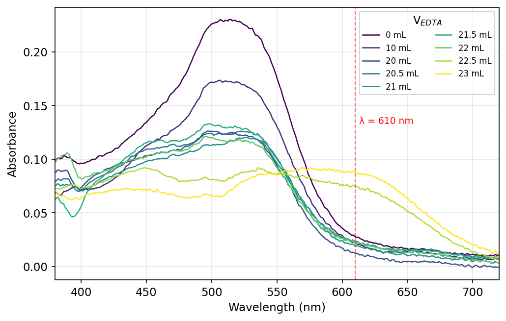
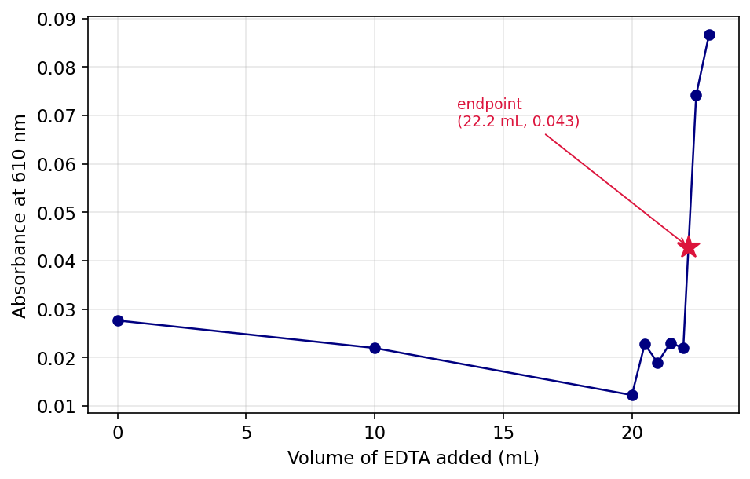
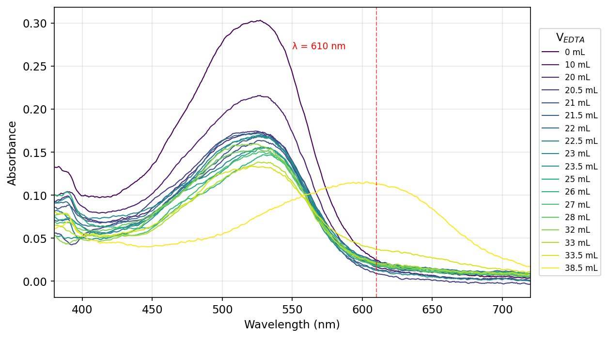
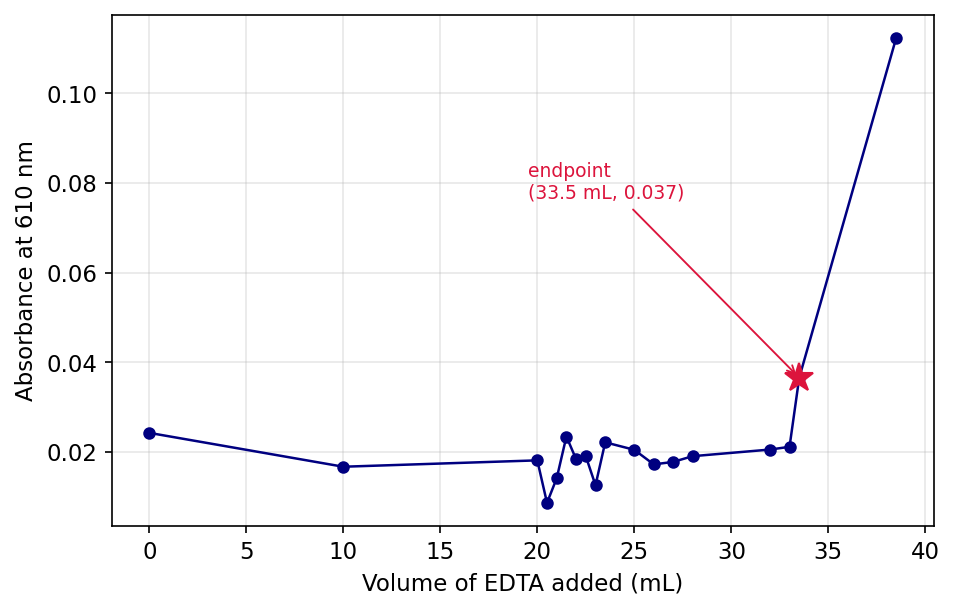
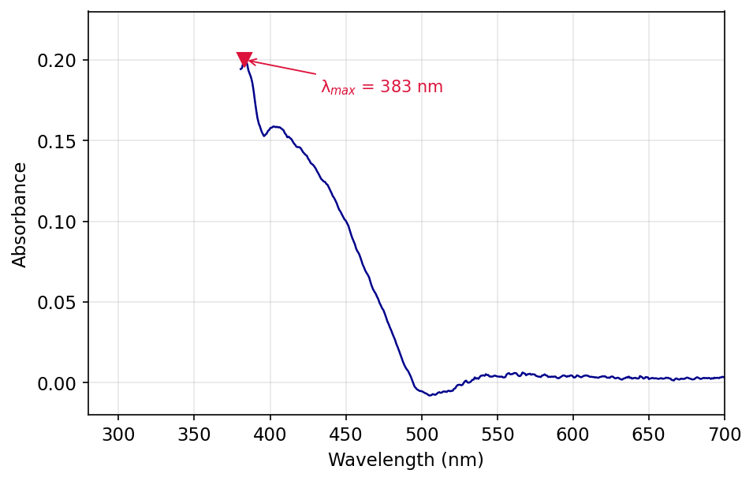
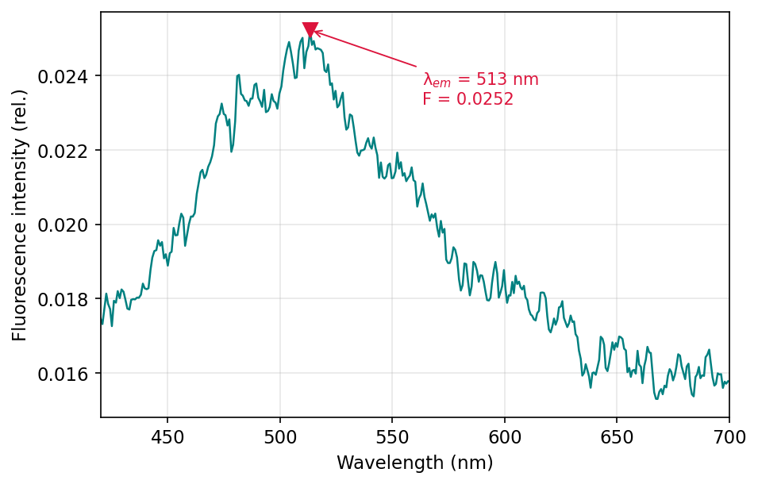
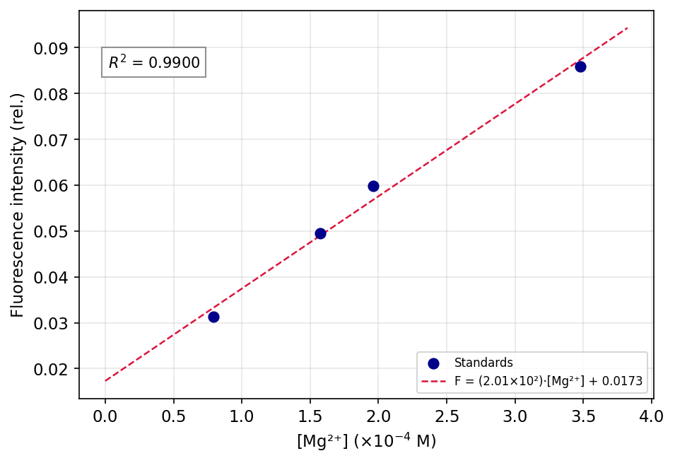

# Introduction

Magnesium (Mg) is the main divalent ion in hard water, and its concentration is important for drinking-water standards, for controlling industrial scaling, and for biological assays. An unknown solution of $\text{MgCl}_2$ was measured two different ways and the results compared. The $K_f$ of $\text{MgY}^{2-}$ ($\sim 10^{8.7}$) is much greater than that of Mg–Calmagite, and the indicator changes colour from wine-red to blue at the endpoint when the moles of EDTA have equalled the moles of $\text{Mg}^{2+}$, so the answer is the volume of titrant. The fluorescence reading with HQS gives the same concentration off a calibration curve — quicker and more sensitive, but only valid inside the calibrated fluorescence window and at pH $\approx 8$. The cross-comparison tests both methods on the same sample so that each method's working range and failure mode shows up against the other.

# Data Analysis

## Part A

### Q1. Overlaid absorbance spectra of Mg(II)/Calmagite at each titration point

**Figure 1.** Absorbance of the 0.0100 M $\text{MgCl}_2$ solution at V = 0–23 mL of 0.0100 M EDTA. The wine-red Mg–Calmagite band at 510 nm decays and a blue free-Calmagite band rises near 610 nm; the dashed line marks $\lambda = 610$ nm used in Q2.

*The V = 28 mL spectrum was excluded: it shows $A_{500} = 0.299$, higher than V = 0, which is impossible under dilution + Mg consumption (cuvette/sample handling error).*

### Q2. Absorbance at 610 nm vs. volume of EDTA added (Part A standardization)

**Figure 2.** $A_{610}$ vs. V for the standardization. Baseline holds until V = 22 mL, then jumps as blue Calmagite forms; star marks the visual endpoint $(22.2\ \text{mL}, 0.043)$.

### Q3. Average [EDTA] and 95 % CI from shared Part A data

Three groups posted Part A endpoints: $V_\text{eq} = \{22.5,\ 22.7,\ 22.2\}$ mL. For each, $[\text{EDTA}] = (0.0100\ \text{M})(25.00\ \text{mL})/V_\text{eq}$:

$$[\text{EDTA}]_i = \{0.01111,\ 0.01101,\ 0.01126\}\ \text{M}$$

$\bar{x} = 0.01113$ M, $s = 1.25\times 10^{-4}$ M, $t_{0.05,2} = 4.303$:

$$[\text{EDTA}] = \bar{x} \pm \frac{t s}{\sqrt{n}} = 11.1 \pm 0.3\ \text{mM}$$

*Manual requested $\geq 5$ trials; only 3 groups have posted at the time of writing.*

## Part B

### Q4. Overlaid absorbance spectra of unknown $\text{MgCl}_2$/Calmagite at each titration point

**Figure 3.** Absorbance of unknown $\text{MgCl}_2$ at V = 0–38.5 mL of 0.0113 M EDTA. The 525 nm Mg–Calmagite band dominates through V = 33.5 mL; at V = 38.5 mL it shifts to the blue free-Calmagite band at 603 nm. Dashed line: $\lambda = 610$ nm.

### Q5. Absorbance at 610 nm vs. volume of EDTA added (Part B unknown)

**Figure 4.** $A_{610}$ vs. V for the unknown. Baseline through V = 33.5 mL, jump to 0.11 at V = 38.5 mL; star marks the visual endpoint $(33.5\ \text{mL}, 0.037)$.

### Q6. Average $[\text{MgCl}_2]$ of unknown and 95 % CI from shared Part B data

Three groups posted Part B endpoints: $V_\text{eq} = \{33.0,\ 34.0,\ 33.5\}$ mL. Using the Q3 average $[\text{EDTA}] = 0.01113$ M:

$$[\text{MgCl}_2]_{\text{unk},i} = \frac{(0.01113\ \text{M})\cdot V_\text{eq}}{25.00\ \text{mL}} = \{0.01469,\ 0.01513,\ 0.01491\}\ \text{M}$$

$\bar{x} = 0.01491$ M, $s = 2.22\times 10^{-4}$ M:

$$[\text{MgCl}_2]_\text{unk} = 14.9 \pm 0.6\ \text{mM}$$

*Only 3 groups posted; manual requested $\geq 5$.*

## Part C

### Q7. Absorbance spectrum of the Mg(II)/HQS solution

**Figure 5.** Absorbance of the unknown Mg–HQS solution. $\lambda_\max = 383$ nm with a shoulder near 405 nm.

### Q8. Choice of $\lambda_\text{excitation}$ (405 nm vs. 500 nm)

405 nm: $A_{405} = 0.16$ while $A_{500} \approx 0$, so the Mg–HQS complex absorbs at 405 nm but not at 500 nm.

### Q9. Fluorescence spectrum of the unknown $\text{MgCl}_2$/HQS solution

**Figure 6.** Fluorescence emission at $\lambda_\text{exc} = 405$ nm: $\lambda_\text{em} = 513$ nm, peak intensity 0.0252 (rel.). All three of my replicate readings (0.0233, 0.0243, 0.0252) fell below the 0.032–0.085 calibration window.

### Q10. Mg–HQS fluorescence calibration curve

**Figure 7.** Calibration: $F = (2.01\times 10^{2}\ \text{M}^{-1})[\text{Mg}^{2+}] + 0.0173$, $R^2 = 0.990$. Concentrations were back-calculated from the 0.0100 M $\text{MgCl}_2$ stock diluted into HQS, e.g. $(0.0100)(0.8)/(0.8+100) = 7.94\times 10^{-5}$ M.

### Q11. Slope and intercept with 95 % CI

For $n = 4$, df = 2, $t_{0.05,2} = 4.303$. Regression statistics: $s_{y|x} = 2.79\times 10^{-3}$, $\sum(x_i - \bar{x})^2 = 3.80\times 10^{-8}\ \text{M}^2$, giving $\mathrm{SE}_m = 14.3\ \text{M}^{-1}$, $\mathrm{SE}_b = 3.12\times 10^{-3}$.

$$m = (2.0 \pm 0.6) \times 10^{2}\ \text{M}^{-1} \qquad b = 0.02 \pm 0.01$$

### Q12. Average $[\text{MgCl}_2]_\text{unk}$ and 95 % CI from fluorescence

Three groups posted Part C fluorescence values (each with the same 0.5 mL / 25.0 mL HQS dilution): $F = \{0.02170,\ 0.02166,\ 0.02430\}$. Inverse-regress each through $[\text{Mg}^{2+}]_\text{dil} = (F - b)/m$, then apply the 51× back-dilution factor:

$$[\text{MgCl}_2]_{\text{unk},i} = \frac{(F_i - 0.01730)}{201.4\ \text{M}^{-1}} \times 51.0 = \{1.11,\ 1.10,\ 1.77\}\times 10^{-3}\ \text{M}$$

$\bar{x} = 1.33\times 10^{-3}$ M, $s = 3.83\times 10^{-4}$ M:

$$[\text{MgCl}_2]_\text{unk} = 1.3 \pm 1.0\ \text{mM}$$

*Only 3 groups posted; manual requested $\geq 5$. The wide CI reflects the third group's outlier-high $F$, and that all three measurements fell below the calibration window.*

# Discussion

### Q13. Percent error for each method

$[\text{MgCl}_2]_\text{true} = 0.0150$ M.

EDTA: $\%\text{err} = |0.01491 - 0.0150|/0.0150 \times 100\% = 0.6\%$.
HQS: $\%\text{err} = |0.00133 - 0.0150|/0.0150 \times 100\% = 91\% \rightarrow 90\%$ (1 sf).
EDTA was the more accurate method.

### Q14. Hypothesize one reason for error in each method.

**EDTA:** the observed deviation is due to the uncertainty of $\pm 0.2$ mL on the visual endpoint for a titration of $\sim 33$ mL: this is a deviation of $\pm 0.6\%$ of the volume.

**HQS:** all three measured intensities were less than the lowest calibration standard (0.031), meaning that each back-calculation is an extrapolation. The 51× dilution factor will amplify any small offset (pH drift from 8, failure to mix the 0.5 mL aliquot) into a large concentration error.

### Q15. Describe what is happening to $\text{Mg}^{2+}$ in the solution described in Parts A/B before any EDTA is added and before and after the endpoint of the titration with EDTA is reached.

Prior to EDTA, $\text{Mg}^{2+}$ is largely aquated and only a small proportion exists as the wine-red Mg–Calmagite complex. In titration: EDTA binds $\text{Mg}^{2+}$ first (with $K_f$ greater than that of water and Calmagite), then removes $\text{Mg}^{2+}$ from Calmagite to form colourless $\text{MgY}^{2-}$. Once the endpoint has been reached, all $\text{Mg}^{2+}$ has been complexed into $\text{MgY}^{2-}$, Calmagite reverts to its blue free form, and excess EDTA remains unreacted.

### Q16. Describe what is happening to $\text{Mg}^{2+}$ before and after HQS is added in Part C.

Before HQS: $\text{Mg}^{2+}$ is aquated as $[\text{Mg}(\text{H}_2\text{O})_6]^{2+}$, non-fluorescent. After HQS is added, it chelates $\text{Mg}^{2+}$ through phenolate-O and pyridine-N to form rigid $\text{Mg(HQS)}_2$, whose locked geometry suppresses non-radiative decay so the complex emits at 513 nm when excited at 405 nm.

# Instrumentation

### Q17. What is HQS? How is it different from EDTA?

HQS (8-hydroxyquinoline-5-sulfonic acid) is a bidentate chelator that forms fluorescent complexes with $\text{Mg}^{2+}$ through phenolate-O and ring-N. EDTA is a hexadentate chelator with a much higher $K_f$ for $\text{Mg}^{2+}$ ($\sim 10^{8.7}$ vs. $\sim 10^{4{-}5}$ for Mg–HQS), so EDTA is used as the stoichiometric titrant while HQS is used as the spectroscopic probe — *fluorescence*, not binding strength, is the readout.

### Q18. Why do we use a buffer in Parts A and B? Why do we check pH in Part C? Explain why the pH matters for each experiment.

It is only the fully deprotonated $\text{Y}^{4-}$ form of EDTA that reacts effectively with $\text{Mg}^{2+}$, which means that a higher pH will favour the reaction; however, above pH 10 $\text{Mg}^{2+}$ will precipitate as $\text{Mg(OH)}_2$. Parts A/B are held in the $\text{NH}_4\text{OH}$ buffer to maximise $[\text{Y}^{4-}]$ while minimising loss of Mg to hydroxide. In Part C, Mg–HQS is very pH sensitive and has maximum fluorescence intensity at pH 8, so the pH paper test verifies that the unknown is in the same range as the calibration standards.
